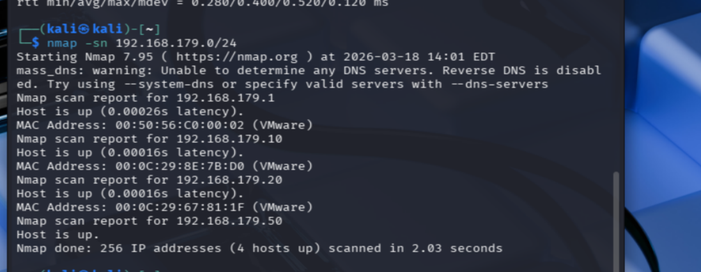
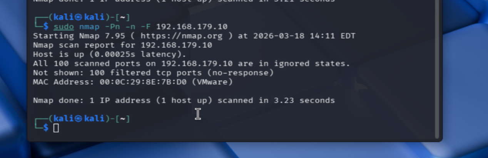
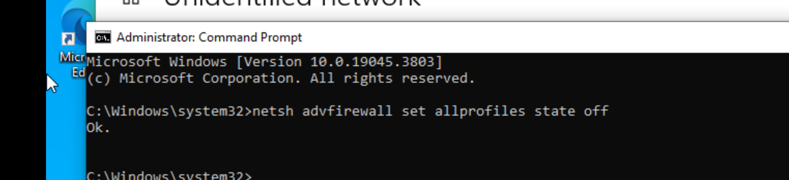
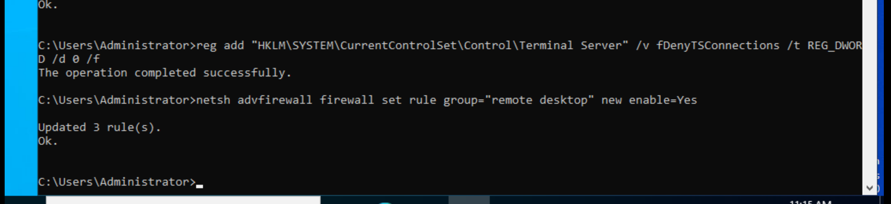
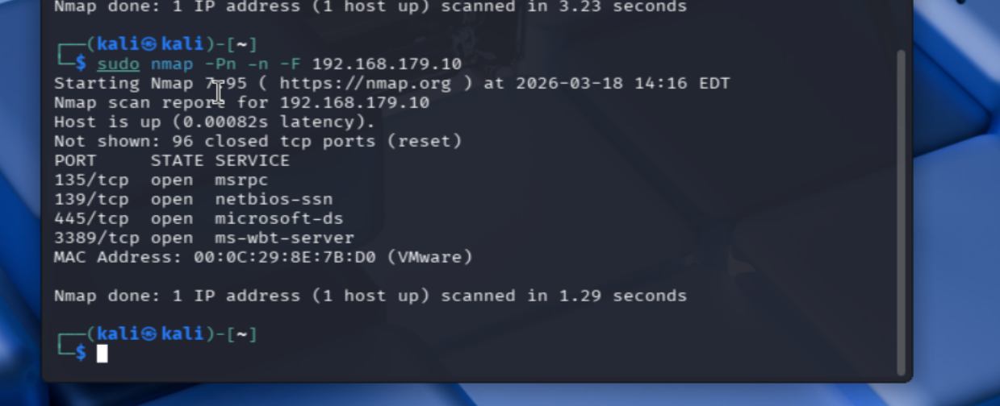

# Active Directory Attack Lab

## 🖥️ Lab Overview
This lab demonstrates network reconnaissance, firewall evasion, and service enumeration against a Windows Server in a controlled environment.

## 🧪 Lab Environment

- Attacker Machine: Kali Linux
- Target Machine: Windows Server
- Virtualization: VMware
- Network: 192.168.179.0/24 (Host-only)

---

## 🔍 1. Network Discovery
<p align="center">
  
</p>

- Used network discovery scan:

```
nmap -sn 192.168.179.0/24
```

- Identified live hosts on the subnet
- Discovered multiple active systems in the lab environment

## 🚫 2. Initial Scan (All Ports Filtered)
<p align="center">
  
</p>

- Conducted a fast scan using:

```
nmap -Pn -n -F 192.168.179.10
```

- All ports appeared filtered due to firewall restrictions, preventing service enumeration

## 🔥 3. Firewall Disabled
<p align="center">
  
</p>

- Disabled Windows Firewall to allow traffic:

```
netsh advfirewall set allprofiles state off
```

- This removed firewall filtering and exposed previously hidden services to enumeration
  
## 🖥️ 4. RDP Enabled
<p align="center">
  
</p>

- Enabled Remote Desktop:

```
reg add "HKLM\SYSTEM\CurrentControlSet\Control\Terminal Server" /v fDenyTSConnections /t REG_DWORD /d 0 /f
netsh advfirewall firewall set rule group="remote desktop" new enable=Yes
```

- This exposed port 3389 for remote access

## ✅ 5. Final Scan (Successful Enumeration)
<p align="center">
  
</p>

- Re-ran the port scan:

```
nmap -Pn -n -F <target>
```

- Open ports identified:
- 135 (MSRPC)
- 139 (NetBIOS)
- 445 (SMB)
- 3389 (RDP)

- Services became visible after firewall was disabled and RDP was enabled

## 🧠 MITRE ATT&CK Mapping

- Network Discovery → T1046 (Network Service Discovery)
- Service Enumeration → T1046
- Remote Desktop Access → T1021.001 (Remote Services: RDP)

## 📘 Lessons Learned

- Firewalls can completely obscure network visibility during reconnaissance  
- Misconfigurations significantly increase attack surface  
- Proper enumeration is critical before attempting exploitation 

## 🎯 Security Impact

- Disabling firewall protections significantly increases attack surface
- Exposed services such as SMB and RDP are common entry points for attackers
- Misconfigurations like these can lead to lateral movement or full system compromise in a real-world environment
